# codyssey_E1-3
> AI가 계산하는 방식을 흉내 내는 작은 계산기 만들기 

## [프로젝트 한줄 설명]
서로 다른 N x N 행렬을 MAC 연산 구현 통해 패턴을 판별하는 Mini NPU 시뮬레이터   

## [개발 환경]
- Python 3.8 이상
- 외부 라이브러리 사용 금지(NumPy, pandas 등)
- 표준 라이브러리(json, time 등)만 허용
```
$python --version
Python 3.12.13

import sys
import time
import json
import re
```
## [실행 방법]
1. 저장소 복제
2. 메인 파일로 이동
3. 실행
```
$ git clone https://github.com/roiker7/codyssey_E1-3.guit
$ cd main
$ python main.py
```

## [프로젝트 목표]
- MAC(Multiply-Accumulate) 연산이 무엇이고, AI에서 왜 중요한지 설명할 수 있다.
  - 
- 입력 패턴과 필터를 곱하고 더해서 유사도(점수)를 계산하는 원리를 설명할 수 있다.
- data.json의 “키 규칙/라벨 규칙”을 해석하고, 프로그램 내부에서 라벨을 표준화(정규화)하는 이유를 설명할 수 있다.
- 부동소수점 오차가 판정에 어떤 영향을 주는지, 그리고 허용오차(epsilon) 기반 비교 정책이 필요한 이유를 설명할 수 있다.
- 크기별 연산 시간을 측정하고, 패턴 크기 증가에 따른 시간 복잡도 O(N²)를 근거와 함께 설명할 수 있다.
- 실패 케이스가 발생했을 때 원인을 “데이터/스키마 문제 vs 로직 문제 vs 수치 비교 문제”로 분리해 진단하고 개선할 수 있다.

## [주요 파일 설명]
| 파일명 | 설명 |
| :--- | :--- |
| `main.py` | 프로그램 실행 시작점 및 메인 메뉴 호출 |
| `menu.py` | 사용자 메뉴 출력 및 모드별 실행 연결 |
| `function1.py` | (모드 1) 3x3 수동 입력 데이터의 MAC 연산 및 판정  |
| `function2.py` | (모드 2) JSON 데이터 자동 분석, PASS/FAIL 판정 및 결과 리포트 출력  |
| `generator.py` | 자동으로 패턴을 생성하고 JSON 파일에 데이터 추가 |
| `loads.py` | JSON 파일 로드 및 크기·스키마 유효성 사전 검증 |
| `exception.py` | 잘못된 입력 처리 및 안전한 종료·재입력 예외 관리 |
| `data.json` | 프로젝트에서 사용할 데이터 셋 |

## [프로그램 실행 흐름]
프로그램 실행 시 아래 흐름이 순서대로 동작한다

- 원하는 메뉴 선택: 
  - 사용자 입력
    - 필터 A, B 입력 → 패턴 입력 → MAC 연산 → 결과 판정 → 1차원과 2차원의 성능 차이 출력
  - data.json 분석
    - 필터,패턴 로드 검증 → MAC 연산/판정/PASS-FAIL 출력 → 성능 분석
  - 랜덤 패턴 생성
    - 사용자로 부터 입력을 받아 NxN 배열 생성 후 data.json파일에 추가 저장

## [실제 프로그램 동작 스크린 화면]
- 프로그램 실행하면 나오는 메뉴화면
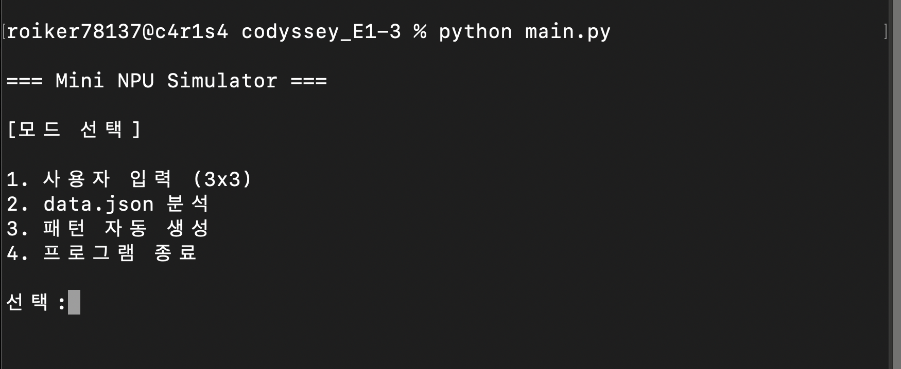
<br><br>

- 사용자가 메뉴에서 ctrl c/d를 누를 때 강제 종료되는 것을 막기
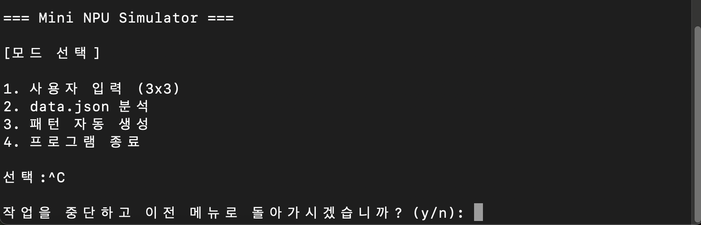
<br><br>

- 1번 기능 (모드1)을 선택했을 때 나오는 화면
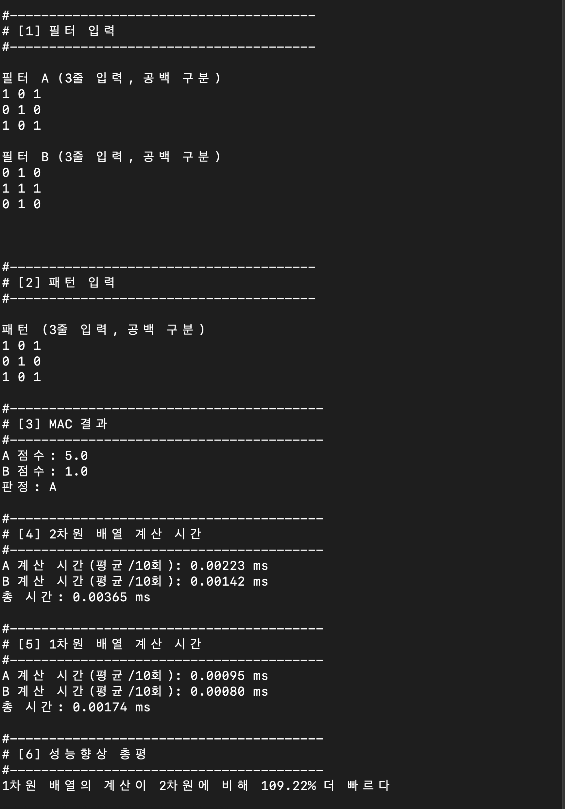
<br><br>

- 모드 1번에서 사용자가 숫자 4개를 입력 했을 때 예외처리
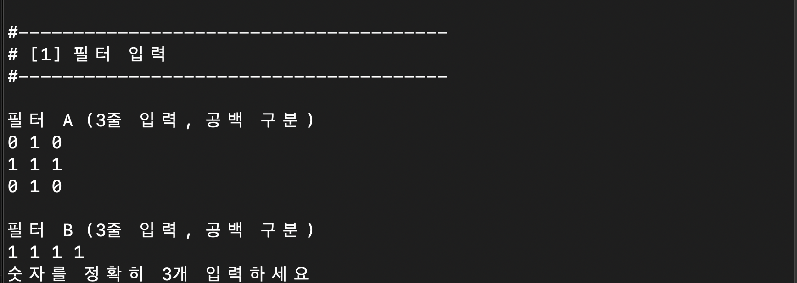
<br><br>

- 모드 1번에서 사용자가 문자를 입력 했을 때 예외처리
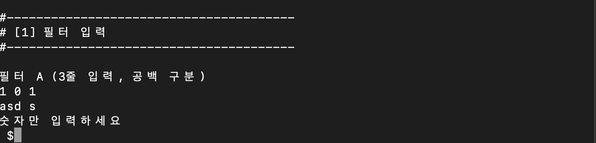
<br><br>

- 사용자로 부터 숫자를 입력 받고 랜덤으로 패턴 생성
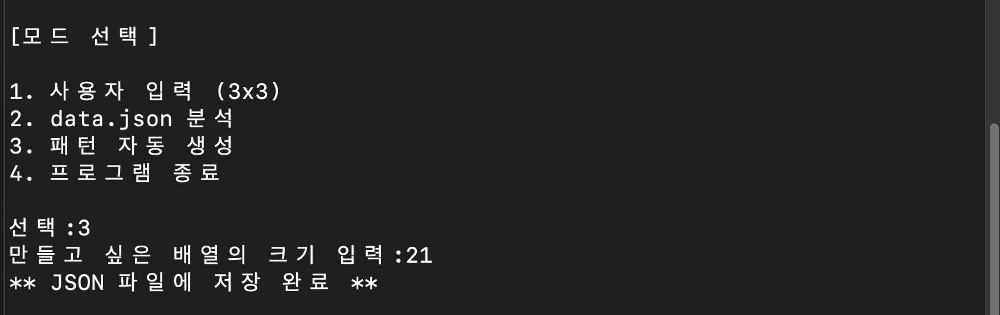
<br><br>

- 랜덤으로 생성된 패턴이 올바르게 json파일에 저장되어 있는지 확인
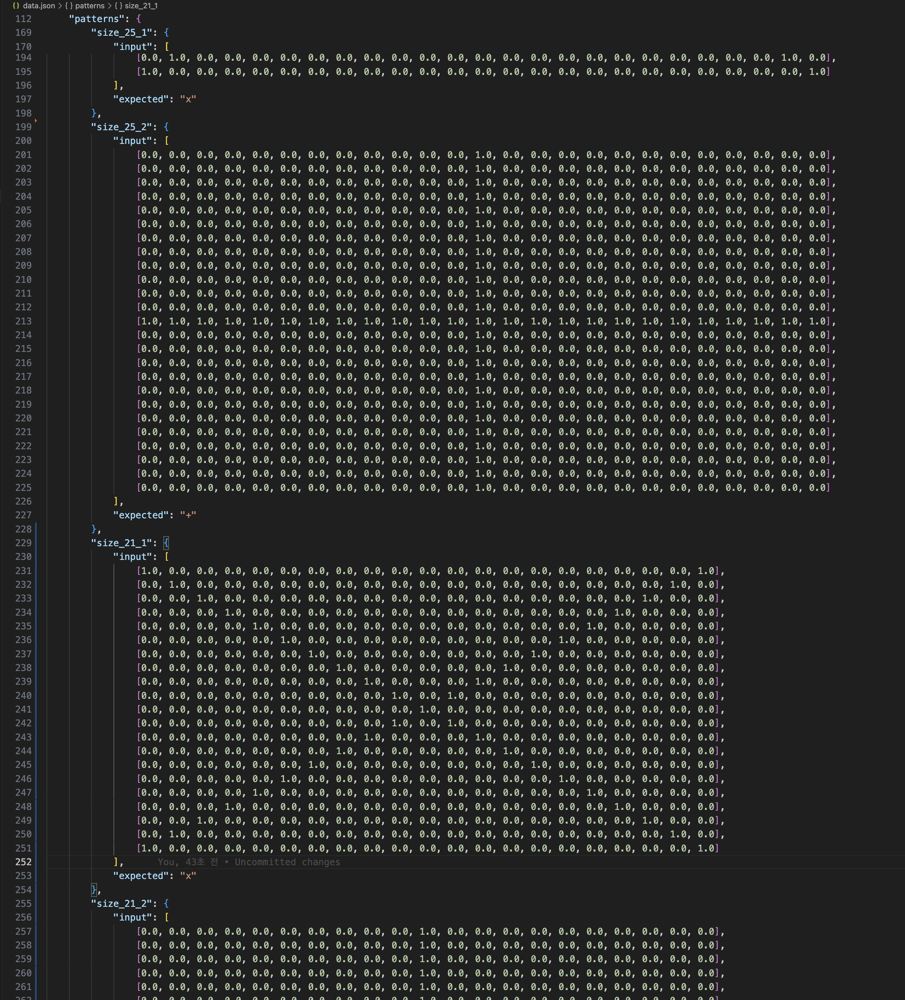
<br><br>

- 모드 2번실행시 json파일에 저장되어 있는 데이터를 베이스로 작동
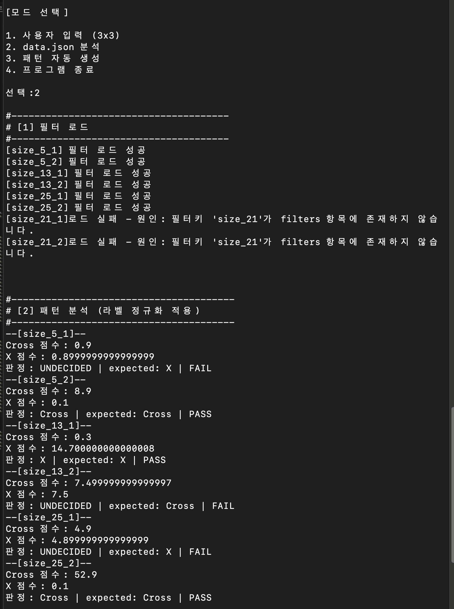
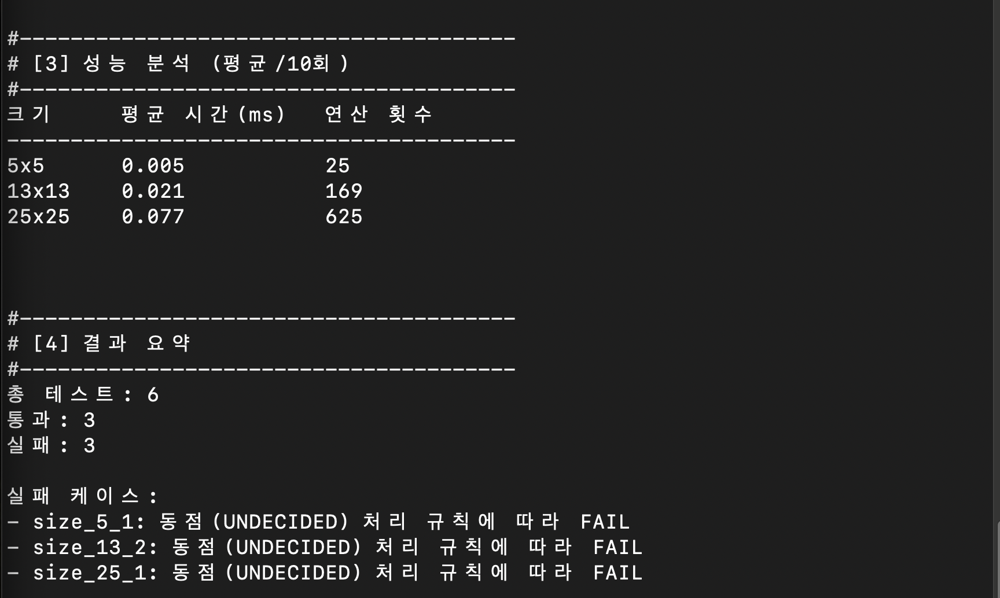
<br><br>

- 프로그램을 종료할 때
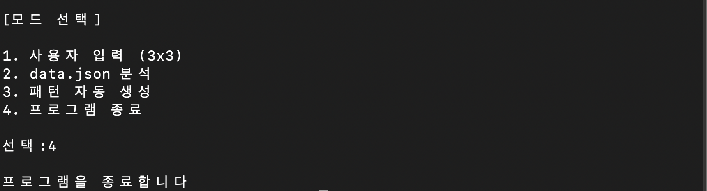
<br><br>

## 주요 구현 방식 설명
- 라벨 정규화 방식: 모드 2번에서 패턴과 필터를 비교 할 때 정의된 값을 통일하여 비교 
```
def standard(input_val: str):
    LABEL_MAP = {
        '+': 'Cross',
        'cross': 'Cross',
        'x': 'X'
    }
    if not input_val:
        return input_val
    cleaned = input_val.strip().lower()
    return LABEL_MAP.get(cleaned, input_val)
```

- MAC 연산 구현: 같은 자리에 있는 것을 같은 인덱스를 사용하여 계산
(겹치는 것끼리 곱하고 그 결과를 모두 더한다)
```
# MAC 계산
def calculate_2d(fil, pat):
    ave_time, times = 0, 0

    for _ in range(REPEAT):
        start = time.perf_counter()  # 시간 시작

        total = 0
        for y in range(N):
            for x in range(N):
                total += fil[y][x] * pat[y][x]

        end = time.perf_counter()  # 시간 끝
        times += ((end - start) * 1000) 
    ave_time = times / REPEAT
    return total, ave_time
```

- 동점 처리 정책: 문제에서 제시된 1e-9 보다 작을 때에는 구별이 어려워 판정 불가 처리
```
if abs(A_score_2d - B_score_2d) < 1e-9:
    result = "판정 불가 (|A-B| < 1e-9)"
elif A_score_2d > B_score_2d:
    result = "A"
else:
    result = "B"
```

## FAIL 케이스 원인 분석


실패 케이스:
- size_5_1: 동점(UNDECIDED) 처리 규칙에 따라 FAIL
- size_13_2: 동점(UNDECIDED) 처리 규칙에 따라 FAIL
- size_25_1: 동점(UNDECIDED) 처리 규칙에 따라 FAIL

**1. size_5_1**
```
 "size_5_1": {
            "input": [
                [1.0, 0.0, 0.0, 0.0, 1.0],
                [0.0, 1.0, 0.0, 1.0, 0.0],
                [0.0, 0.0, 1.0, 0.0, 0.0],
                [0.0, 1.0, 0.0, 1.0, 0.0],
                [1.0, 0.0, 0.0, 0.0, 1.0]
            ],
            "expected": "x"
        }
```
누가 보아도 X 인데 왜 fail일까를 고민해본 결과 해답을 필터에서 찾을 수 있었습니다.
실제 size 5인 필터를 보면..
```
"size_5": {
            "cross": [
                [0.0, 0.0, 1.0, 0.0, 0.0],
                [0.0, 0.0, 1.0, 0.0, 0.0],
                [1.0, 1.0, 0.9, 1.0, 1.0],
                [0.0, 0.0, 1.0, 0.0, 0.0],
                [0.0, 0.0, 1.0, 0.0, 0.0]
            ],
            "x": [
                [0.1, 0.0, 0.0, 0.0, 0.1],
                [0.0, 0.1, 0.0, 0.1, 0.0],
                [0.0, 0.0, 0.1, 0.0, 0.0],
                [0.0, 0.1, 0.0, 0.1, 0.0],
                [0.1, 0.0, 0.0, 0.0, 0.1]
            ]
```
이렇게 나와 있는데 여기에 함정이 숨겨져 있습니다. 필터의 각 요소가 두 필터가 각각 다름 cross는 각 요소가 1이고 X는 각 요소가 0.1이기 때문에 MAC의 방식인 곱것 끼리의 합을 구하면 요소의 크기로 인해 결과값에 오염이 생길 수 있습니다. 따라서 두 필터 모두 요소값을 통일 하게 되면 올바른 결과가 나옵니다.
분석한 원인: 필터의 각 요소 값의 차이로 인한 오류(cross: 1, X: 0.1)

**2. size_13_2**
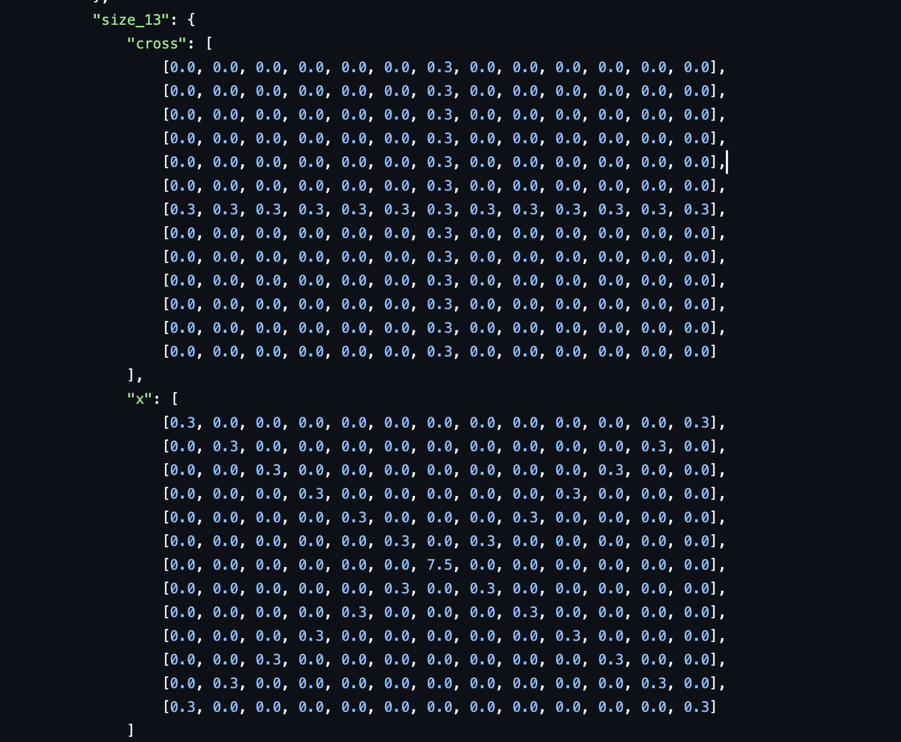
### ⚠️ X 필터 중앙값 과도 비중에 따른 판정 오류

> **요약**: X 필터 정중앙 원소의 가중치(7.5)가 다른 일반 원소들(0.3)에 비해 지나치게 높아, 중앙 원소 단 하나에 의해 전체 판정 점수가 왜곡되는 현상입니다.

#### 1. 필터 내부 가중치 불균형 현황
* **일반 원소 값**: `0.3`
* **정중앙 원소 값**: **`7.5`** (일반 원소 25개 합과 동일한 극단적 가중치)

#### 2. 원인 분석 및 문제점
* **단일 원소의 과도한 지배력**: X 필터 정중앙 값(7.5) 하나가 차지하는 비중이 일반 원소 25개 분량과 맞먹습니다.
* **형태 판정 왜곡**: Cross 패턴의 25개 원소가 모두 필터와 겹칠 때 얻는 점수가 X 필터의 중앙 원소 단 하나와 겹쳤을 때 얻는 점수와 비슷해지는 문제가 발생합니다.
* **유사도 측정 실패**: 전체적인 패턴 모양(X 형태)을 비교하지 못하고, 사실상 **'중앙 픽셀 존재 여부'**만으로 최종 점수가 결정되어 오판정을 유발합니다.

#### 3. 개선 방향
* 필터 내부 특정 위치에 가중치가 쏠리지 않도록 **원소 간 가중치 비율을 적절히 평탄화**하거나, 중앙 이상치를 **정규화** 처리해야 합니다.

**3.size_25_1**

### ⚠️ 필터 간 스케일 불일치로 인한 결과 오염 문제

> **요약**: 필터 원소 값의 가중치 스케일 차이(1.0/4.9 vs 0.1)로 인해, 단순 MAC 연산 시 실제 구조적 유사도가 아닌 **필터 자체의 크기에 따라 결과가 왜곡되는 현상**입니다.

#### 1. 필터 원소 값 현황
* **Cross 필터**: 기본 원소 `1.0` / 중앙 원소 **`4.9`** (높은 가중치)
* **X 필터**: 기본 원소 **`0.1`** (낮은 가중치)

#### 2. 원인 분석 및 문제점
* **MAC 연산 특성**: 원소별 곱의 누적합($\sum A_{ij} B_{ij}$) 구조상, 패턴과의 형태적 유사도보다 **필터 내부 원소 값의 절대적 크기**가 최종 점수를 크게 지배합니다.
* **결과 오염**: 필터 간 값의 스케일 차이(최대 49배)로 인해, 실제로 X 형태인 패턴이라도 Cross 필터와의 연산 점수가 더 높게 측정되는 판정 오염이 발생합니다.

#### 3. 개선 방향
* 정확한 패턴 판정을 위해 필터 생성 시 **원소 값의 스케일을 통일(정규화)**하거나, 필터 전체 합의 비중을 맞추는 사전 처리가 필요합니다.
  
## 성능 표 해석 근거(연산 횟수와 측정 결과를 연결)
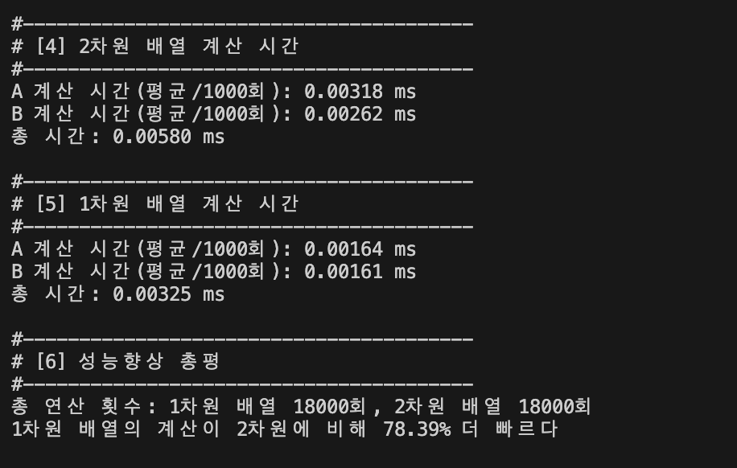
1차원 배열 vs 2차원 배열 연산의 오해와 진실
> 요약: 총 연산 횟수는 동일하지만, 1차원 배열화를 통해 루프 오버헤드를 줄이고 시간적인 이득을 얻을 수 있습니다.
- ❌ 흔한 오해
  - "2차원 배열은 이중 for문이고 1차원 배열은 단일 for문이므로 1차원 배열의 연산 횟수가 더 적다?"
- ⭕ 실제 사실
  - 총 연산 횟수는 동일합니다.<br><br>
- 1차원 배열 전환 시 이점루프 오버헤드 감소: 반복문 제어 조건 체크가 2번에서 1번으로 줄어들어 미세한 실행 시간 단축 효과가 발생합니다.
- 코드 가독성 향상: 인덱싱 구조가 단순해져 코드가 훨씬 깔끔해집니다.
- 실무 활용성: 대량의 데이터를 다루는 딥러닝이나 이미지 처리 분야에서는 연산 효율성을 위해 2차원 데이터를 1차원으로 펼쳐서처리하는 방식을 적극 활용합니다.

결론: 연산 횟수 자체는 같더라도, 루프 구조가 단순해짐에 따라 실제 실행 시간 측면에서는 1차원 배열 형태가 더 유리합니다.


